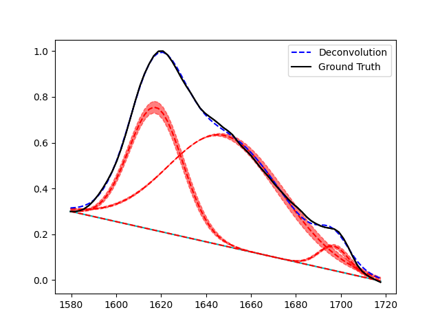

# Plotting

Plotting that is supported by PyPeakify is all handled using `matplotlib`, and as such, all `Peak` objects and `Deconvolution` objects have plotting functions that accept a `matplotlib` axis object as input. 

## Error Bars

The `show_error` parameter of the `plot` function can be used to show error bars for the peaks, computed as the 1-sigma error bars from the covariance matrix of the optimization.

Below, a linear baseline correction with three Gaussian peaks is plotted with 1-sigma error bars.

```python
... # Load spectrum, initialize peaks and baseline

# Fit the peaks to the spectrum
deconv = Deconvolution([p1, p2, p3], baseline)
deconv.fit(x, y)

# Plot the spectrum and the fitted peaks with error bars
plt.figure()

plt.plot(x, y, c='k')
plt.plot(x, baseline(x), c='c', ls='-')

deconv.plot(plt.gca(), x, y, show_error=True)

plt.legend()
plt.show()
```



## Customization

All `plot` functions support `**kwargs` -- keyword arguments -- that are passed directly to the `matplotlib` plotting functions. This allows for customization of the plot, such as changing the color of the peaks, the linestyle, or the linewidth.

Outside of the parameters offered by the `plot` functions of each object, it is easy to generate the data used in the plotting by using functions provided by each object.

Each `Peak` object in the `peaks` member of a `Deconvolution` object is a callable object that can be used to generate the peak data over a set of `x` values, i.e.
```python
peak_1 = deconv.peaks[0]
x = np.linspace(0, 10, 1000)
y = peak_1(x)
```
The upper and lower error bars can be generated similarly, using the `get_fit_error` function of the `Peak` object, but only after the `Peak` object has been fit to a spectrum.
```python
peak_1 = deconv.peaks[0]
x = np.linspace(0, 10, 1000)
ub, lb = peak_1.get_fit_error(x)
```

Similarly, both the `Baseline` and `Deconvolution` objects are themselves callable, and the same call signature can be used to generate the baseline correction along a set of `x` values as well as to generate the fit itself.
```python
x = np.linspace(0, 10, 1000)

full_fit = deconv(x)
baseline = deconv.baseline(x)
```

This generated data can then be used to plot the data in any way that is desired, using the full power of `matplotlib`, or other plotting libraries.
