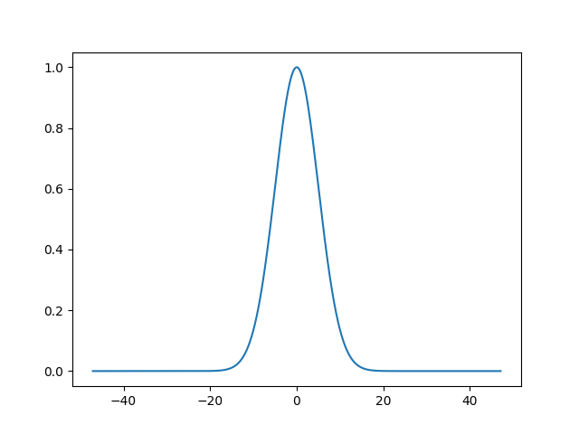
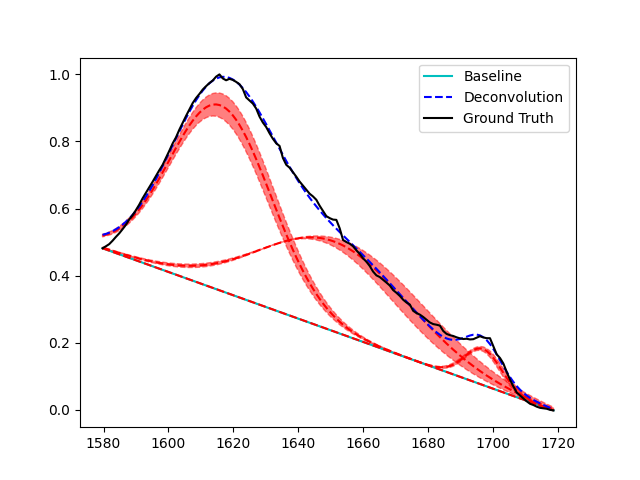

# Usage

PyPeakify provides a high-level interface for performing peak deconvolutions of various spectra. The primary objects used in this process are `Peak` objects, which represent individual peaks in the spectrum, and `Deconvolution` objects, which represent the optimization problem of fitting a sum of peaks to a spectrum. Additionally, `Baseline` objects can be used to represent the background signal in the spectrum, and can be passed to a `Deconvolution` object to correct the spectrum before fitting the peaks. This guide will walk through the basic usage of these objects, and provide examples of their use on actual data.

## Peaks

When starting a deconvolution, often the user will have known information about hard or soft constraints on a peak's width, amplitude, and position, and may even have a good guess of what the true parameters are. The `Peak` object encapsulates all these things.

```python
import matplotlib.pyplot as plt
import numpy as np

from pypeakify.peak import Peak

peak = Peak('gaussian', 
          width=5, amplitude=1, position=0,
          constrain_width=(0, np.inf), constrain_amplitude=(0, np.inf), constrain_position=(-2, 2))

plt.figure()
peak.plot(plt.gca())
plt.show()
```

### Output


In the above example, we have defined a Gaussian peak with an initial width of 5, amplitude of 1, and position of 0. Additionally, we have also set optimization constraints on all three parameters. Note the use of `np.inf` to represent no upper bound on with and amplitude. The corresponding representation of no lower bound is simply `-np.inf`.

## Baselines

Baseline correction is a pre-processing technique used to remove the background signal from a spectrum. PyPeakify provides a few options and a simple interface to apply baseline correction to a spectrum. Because `Baseline` objects are themselves simply callable objects of the form `baseline(x: np.ndarray) -> np.ndarray`, custom baseline corrections can be easily defined and passed to a `Deconvolution` object.

```python
import matplotlib.pyplot as plt
import numpy as np

from pypeakify.baseline import PiecewiseLinearBaseline

x_nodes = np.arange(5)
y_nodes = np.array([1, 2, 1, 3, 1])
baseline = PiecewiseLinearBaseline(x_nodes, y_nodes)

x = np.linspace(-1, 5, 500)

plt.figure()
plt.scatter(x_nodes, y_nodes)
plt.plot(x, baseline(x), c='k')
plt.show()
```

### Output


In the above example, we have defined a piecewise linear baseline correction with 5 nodes. The baseline is defined by the points `(0, 1)`, `(1, 2)`, `(2, 1)`, `(3, 3)`, and `(4, 1)`. The baseline is then plotted over the range `[-1, 5]`. These baselines are manually specified and, once constructed, can be passed to a `Deconvolution` object.

## Deconvolutions

Once a baseline and peaks have been initialized, a `Deconvolution` object can be created to fit the peaks to the spectrum.

When fit, a deconvolution object modifies *copies* of the peak objects to fit the spectrum. The original peak objects are not modified, and can be used as initial conditions for other deconvolutions. If a deconvolution object that has been fit once is refit to a different spectrum, the current state of the peaks will be used as the initial guess in the optimization problem.

```python
import matplotlib.pyplot as plt
import numpy as np

from pypeakify.deconvolution import Deconvolution

... # Load a spectrum, initialize peaks and baseline

deconv = Deconvolution([peak1, peak2, peak3], baseline)
deconv.fit(x, y)
```

In the above example, we have created a `Deconvolution` object with three peaks and a baseline correction object. The peaks are then fit to the spectrum defined by the arrays `x` and `y`. The `fit` method modifies the peaks in place to fit the spectrum, and the `Deconvolution` object can then be used to plot the spectrum and the fitted peaks. 

## Full Example

Let's take a look at a full working example of deconvolving the Amide I region of an FTIR spectra from a [Bombyx Mori silkworm degummed silk sample](https://raw.githubusercontent.com/yargerlab/Data/main/FTIR/2023_07_10_B_Mori_degummed_silk_1.dpt).

```python
import matplotlib.pyplot as plt
import numpy as np

from pypeakify.peak import Peak
from pypeakify.baseline import PiecewiseLinearBaseline
from pypeakify.deconvolution import Deconvolution
from pypeakify.filereader import import_ascii_url, crop, normalize_data, nearest_points

url = 'https://raw.githubusercontent.com/yargerlab/Data/main/FTIR/2023_07_10_B_Mori_degummed_silk_1.dpt'

# Load, crop, and normalize data
crop_range = [1580, 1720]

data = import_ascii_url(url)
data = crop(*data, crop_range)
x, y = normalize_data(*data, crop_range)

# Initialize peaks
p1 = Peak('gaussian', 
          width=5, amplitude=1, position=1618,
          constrain_width=(0, np.inf), constrain_amplitude=(0, np.inf), constrain_position=(1616, 1622))
p2 = Peak('gaussian',
            width=5, amplitude=1, position=1650,
            constrain_width=(0, np.inf), constrain_amplitude=(0, np.inf), constrain_position=(1645, 1655))
p3 = Peak('gaussian',
            width=5, amplitude=1, position=1698,
            constrain_width=(0, np.inf), constrain_amplitude=(0, np.inf), constrain_position=(1697, 1699))

# Create simple linear baseline
x_nodes = np.array([x[0], x[-1]])
y_nodes = np.array([y[0], y[-1]])
baseline = PiecewiseLinearBaseline(x_nodes, y_nodes)

# Create deconvolution
deconv = Deconvolution([p1, p2, p3], baseline)
deconv.fit(x, y)

# Plot deconvolution
plt.figure()

plt.plot(x, baseline(x), c='c', label='Baseline')

deconv.plot(plt.gca(), x, y, show_error=True)

plt.legend()
plt.show()
```

### Output
```
Peak Type       Width    Amplitude    Position
-----------  --------  -----------  ----------
gaussian     15.6796      0.552349     1616
gaussian     22.9313      0.268229     1650.96
gaussian      5.67015     0.107615     1697
```


